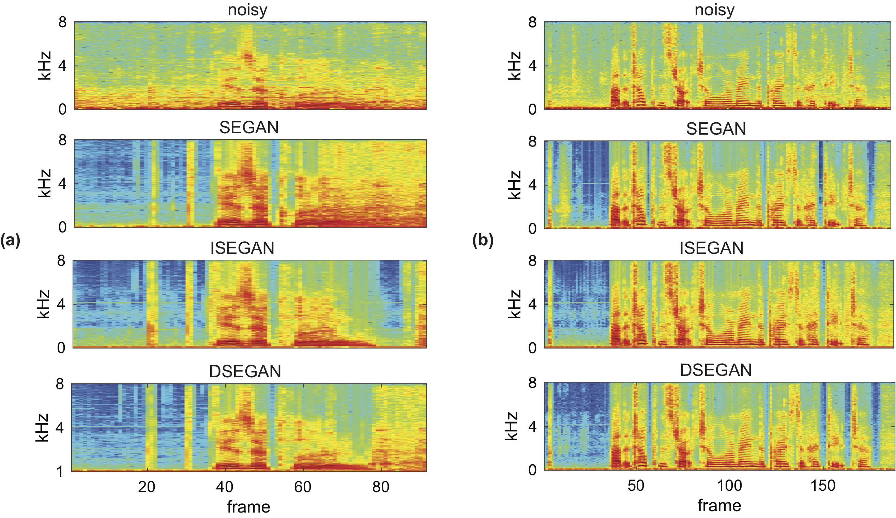

# Exploring Multi-Stage GAN with Self-Attention for Speech Enhancement
 
## Introduction 
Multi-stage or multi-generator generative adversarial networks (GANs) have recently been demonstrated to be effective for speech enhancement. The existing multi-generator GANs for speech enhancement only use convolutional layers for synthesising clean speech signals. This reliance on convolution operation may result in masking the temporal dependencies within the signal sequence. This study explores self-attention to address the temporal dependency issue in multi-generator speech enhancement GANs to improve their enhancement performance. We empirically study the effect of integrating a self-attention mechanism into the convolutional layers of the multiple generators in multi-stage or multi-generator speech enhancement GANs, specifically, the ISEGAN and the DSEGAN networks. The experimental results show that introducing a self-attention mechanism into ISEGAN and DSEGAN leads to improvements in their speech enhancement quality and intelligibility across the objective evaluation metrics. Furthermore, we observe that adding self-attention to the ISEGAN’s generators does not only improves its enhancement performance but also bridges the performance gap between the ISEGAN and the DSEGAN with a smaller model footprint. Overall, our findings highlight the potential of self-attention in improving the enhancement performance of multi-generator speech enhancement GANs.


### Training

Once you have the TFRecords file created in `data/segan.tfrecords` you can simply run one of the following scripts.

```
# ISEGAN: run inside isegan directory
./run_isegan.sh
# DSEGAN: run inside dsegan directory
./run_dsegan.sh
# SEGAN baseline: run inside segan directory
./run_segan.sh
```
Each script consists of commands for training and testing with 5 different checkpoints of the trained model on the test audio files with. You can modify the bash script to customize parameters (e.g. which GPUs to use) and what you want to run.

Enhancement results on two different test files:

[//]: #


 ### Enhanced Wav Files

For comparison purpose, enhanced wave files of DSEGAN with depth of 2 are available at this [here](https://entuedu-my.sharepoint.com/personal/phan0035_e_ntu_edu_sg/_layouts/15/onedrive.aspx?id=%2Fpersonal%2Fphan0035%5Fe%5Fntu%5Fedu%5Fsg%2FDocuments%2FShared%20with%20Everyone%2Fdsegan%2Ddeep2&originalPath=aHR0cHM6Ly9lbnR1ZWR1LW15LnNoYXJlcG9pbnQuY29tLzpmOi9nL3BlcnNvbmFsL3BoYW4wMDM1X2VfbnR1X2VkdV9zZy9FcjBHcGNhbHh3cElzdnVnYmMzaGtNd0JtcVJrYnh2UTl5eGQzQ1U5WXRUMTd3P3J0aW1lPXVTN0t5SFl1MkVn)


## References

```bibtex

@Article{app13169217,
AUTHOR = {Asiedu Asante, Bismark Kweku and Broni-Bediako, Clifford and Imamura, Hiroki},
TITLE = {Exploring Multi-Stage GAN with Self-Attention for Speech Enhancement},
JOURNAL = {Applied Sciences},
VOLUME = {13},
YEAR = {2023},
NUMBER = {16},
ARTICLE-NUMBER = {9217},
URL = {https://www.mdpi.com/2076-3417/13/16/9217},
ISSN = {2076-3417},

DOI = {10.3390/app13169217}
}


```
